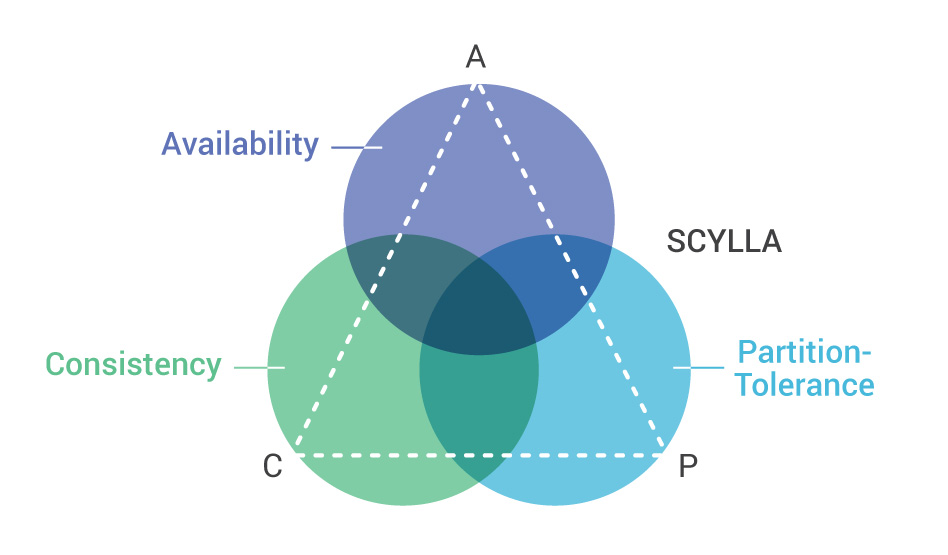

# Задание:
### Согласно теореме CAP к какой части вы можете отнести СУБД:
- ### DragonFly
- ### ScyllaDB
- ### ArenadataDB
---
[_CAP-теорема_](https://neerc.ifmo.ru/wiki/index.php?title=CAP_теорема#:~:text=CAP%2Dтеорема%20—%20утверждение%20о%20том,не%20отказавшим%20узлам%20возвращают%20ответ)
— утверждение о том, что в распределённых системах нельзя одновременно добиться трёх свойств:
1. Consistency — на всех не отказавших узлах одинаковые (с точки зрения пользователя) данные;
2. Availability — запросы ко всем не отказавшим узлам возвращают ответ;
3. Partition tolerance — даже если связь в системе стала нестабильной (вплоть до разделения системы на куски),
но узлы работают, то система в целом продолжает работать.

_Классификация конкретных БД:_

|   | DragonFly | ScyllaDB | ArenadataDB |
|---|-----------|----------|-------------|
| C | ✅         |          |        ✅    |
| P |           |     ✅    |        ✅    |
| A |   ✅       |  ✅       |             |
---
#### _DragonFly_

Данная СУБД относится с CA, так как
1) [Компания](https://www.dragonflydb.io) явным образом делает акцент на доступности данных (High Availability). 
В том же утверждении идет речь о согласованности данных.
    > Dragonfly natively supports an eventually consistent primary-replica model to achieve high availability.
2) Указана возможность вертикального масштабирования, которая реализуется через использования лишь одного 
носителя. Отсюда следует, что систему невозможно разделить на несколько частей. 
    > Dragonfly is a simple system with a single instance for workloads up to 1TB. 

В разделе [Features](https://www.dragonflydb.io/features) есть более
подробная информация: 
- Утверждается, что вертикальное масштабирование происходит с использованием 
"__multi-threaded, shared-nothing architecture__".
- Работа с запросами обещает быть быстрой: высокая пропускная способность, эффективное кэширование,
низкая латентность, асинхронные операции.
    > Non-contending, multi-threaded processing mean much higher throughput on the same hardware.
  
    > Dragonfly’s unique caching algorithm means higher hit rates and better protection for your primary database.

    >Lower tail latency. Consistent sub 1ms P99 latency. 

#### _ScyllaDB_
Данная СУБД относится с AP, так как
1) [Компания](https://www.scylladb.com) делает акцент на отказоустойчивости (Fault Tolerance), отсюда partition tolerance.
2) В [документации](https://opensource.docs.scylladb.com/stable/architecture/architecture-fault-tolerance.html)
сказано, что в условиях CAP делается осознанный выбор в пользу доступности и стабильности.
    > ScyllaDB chooses availability and partition tolerance over consistency, such that:
It’s impossible to be both consistent and highly available during a network partition; If we sacrifice consistency, we can be highly available.
   > 
3) ScyllaDB позиционируется как ["the fastest NoSQL database"](https://www.scylladb.com/learn/nosql/nosql-vs-sql/), 
при этом БД с NoSQL [обычно](https://samaratungajs.medium.com/cap-theorem-nosql-databases-956e192893a6) относятся к двум категориям: CA (MongoDB, Hbase, Redis) или AP (CouchDB, Cassandra, DynamoDB, Riak).
А так как целостность сразу отбрасывается в документации, то остается вариант AP.
    > A higher Consistency Level (more nodes required to be online) means less availability with less tolerance to tolerate node failures.

Также можно отметить, что ScyllaDB использует, как и DragonFly, "__shared-nothing architecture__", чем повышает доступность 
данных, так как убирает долгие блокировки и конкуренцию операций.
#### _ArenadataDB_
Данная СУБД относится с СP, так как
1) На этот раз на [официальном сайте](https://arenadata.tech/products/arenadata-db/) компании не дано выделенных аспектов,
но есть акцент на горизонтальной расширяемости, то есть можно предположить partition tolerance.
2) Более прозрачный признак: СУБД [соответствует](https://arenadata.tech/wp-content/uploads/2020/06/arenadata-profile-1.pdf) принципам ACID,
то есть фокусируется на согласованности и доступности.
    > Есть ли транзакции?
   Есть, это ACID-система, а уровень изоляции транзакций — Serializable.

Снова видим "__shared-nothing architecture__".
> Массивно-параллельная архитектура без разделения ресурсов (shared nothing MPP).
----

#### Таким образом, получилась следующая характеристика СУБД:
- _DragonFly_ - доступна и консистентна. Нежизнеспособна в ненадежной сети, что нивелируется использованием лишь одной машины.
- _ScyllaDB_ - данные на разных работающих узлах могут отличаться, но ответы на запросы всегда приходят за разумное время и 
можно разделять узлы с сохранением работоспособности. 
- _ArenadataDB_ - нет доступна пока нет полной синхронизации между всеми узлами, зато данные всегда актуальны. Корректность 
достигается за счет синхронности операций и блокировок, что звучит довольно медленно и надежно.