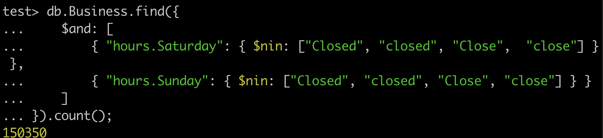
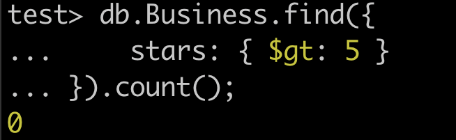
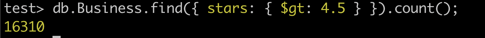
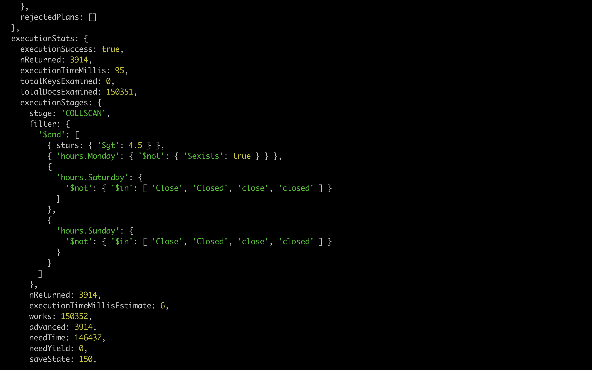
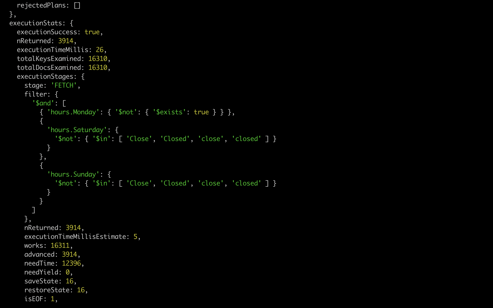
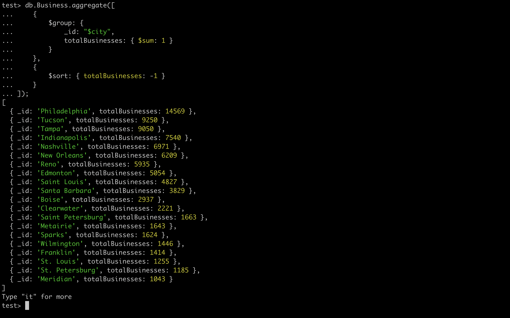

## MongoDB

1. **Установка**: Будем работать с mongoDB с помощью Docker container
   
2. **Загрузка данных**: используем предложенную [ссылку](https://www.yelp.com/dataset/)

3. **find**: посмотрим, как вообще выглядят данные

4. **countDocuments**: посмотрим, сколько записей 

5. **insert**: вставим 5 новых записей следующим образом 

6. **Проверка**: по ответам на операции вставки уже видим, что они
прошли успешно, проверим, узнав новое число записей 

7. **find**: найдем предприятия, работающие по выходным, потом посчитаем их число 

Получилось, что почти все трудоголики.
8. **find**: теперь наоборот, посмотрим, кто не работает в понедельник

Таких уже на порядок меньше.
9. **find**: проверим, есть ли волшебные места с рейтингом > 5

Таких нет, это радует и указывает на корректность данных)
10. **find**: посмотрим число мест с рейтингом >4.5

11. Совместим предыдущие запросы и посмотрим на число

12. **explain("executionStats")**: измерим время запроса
Зафиксировали в уме 95ms
13. **createIndex**: создадим индекс по рейтингу

14. **explain("executionStats")**: проверим на новое время выполнения запроса
Зафиксировали в уме 26ms. Мы выиграли по времени больше, чем в три раза, с помощью индекса.
15. **aggregate**: посмотрим статистику по городам 
16. **update**: пример успешного обновления данных
17. **delete**: напоследок убедимся, что умеем удалять 
18. **delete**: покажем, что умеем удалять по фильтрам 

По итогу знакомства с MongoDB, можно сделать вывод, что NoSQL не менее удобен, чем обычный SQL.

Спасибо за внимание!