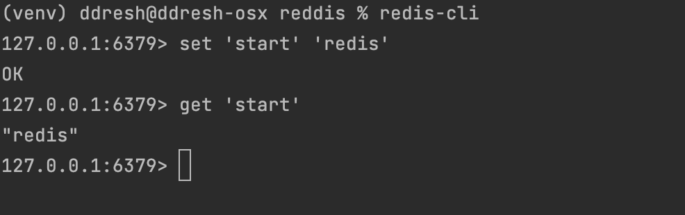

1. Подняли Redis c помощью docker-compose

2. Проверим, что все поднялось 

3. Вставим данные из JSON в виде строк, который весит ~20MB

Видим, что это заняло довольно много времени (примерно 5 секунд)
4. Извлечение по ключу работает относительно быстро (0.03):

5. Вставка с помощью hset работает почти так же по времени

6. Извлечение стало работать быстрее

7. Теперь вставим записи упорядоченными по цене, работает быстро 0.6c

8. Пять самых дешевых товаров ищутся довольно быстро 

9. Вставим списком

10. Извелечение первых пяти записей

11. Запустим кластер из 6 нод через docker-compose

12. Видим, что на нем все работает медленнее

13. Вставки другими методами тоже работают медленнее.
14. При этом извлечение все ешё быстрое.

#### Вывод: за отказоустойчивость платим временем работы.